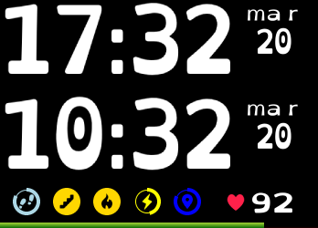

# Description
A really simple clock + a second clock. You can select the seconde clock time zone from settings.
It use a font designed to make life easier for dyslexic people.
This clock is build for fitbit smartwatchs (Ionic, Versa, Versa 2 & Versal Light).

# Features
It include :
- Clock based on our fitbit settings.
- Second Clock based on a time zone that you can change as you want.
- Date.
- Stats (with ability to show or hide).
- Battery indicator (with ability to show or hide).
- Heart Rate Monitor.
- Settings to change colors.

Let me know if you need more ;)

# Demo
This clock can be installed on your Ionic or Versa via this link: [Fitbit store](https://gam.fitbit.com/gallery/clock/830ab660-01f1-49bf-bc2e-fb951a4fb7b4)

# Why?
I have shared this code to allow developer to make more clocks accessible for dyslexic users.

Please do use this clock as this, change it to have your hown design

# How to edit and buid?
This code was build for and with Visual Studio Code.

It use :
- NPM
- Fitbit SDK
- TypeScript
- SVG
- CSS

# Need something?
Ask me if you need any help or new features.